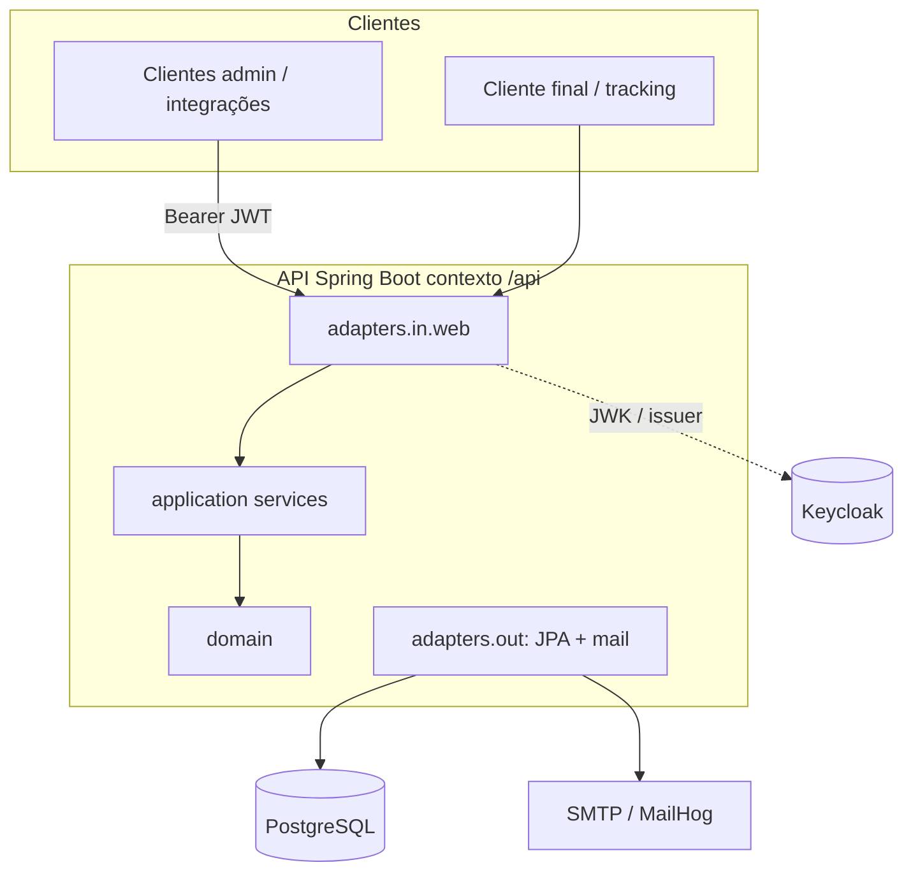
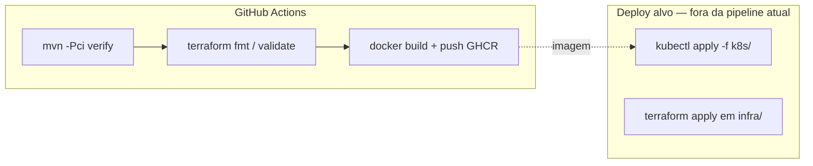

# Oficina Service — Tech Challenge (Fases 1 e 2) — Back-end Spring Boot

Monólito do **Sistema Integrado de Atendimento e Execução de Serviços** para oficina mecânica: gestão de clientes, veículos, catálogo, peças/estoque e **ordens de serviço (OS)** com fluxo completo, consulta pública por `trackingCode`, JWT (Keycloak) e notificações por e-mail.

## Objetivos por fase

| Fase | Foco |
|------|------|
| **Fase 1** | MVP funcional: APIs, persistência, Docker, testes, DDD em Markdown, segurança admin/público. |
| **Fase 2** | **Resiliência e escalabilidade**: Clean Code e **arquitetura hexagonal**, testes nos fluxos críticos, **contêineres**, **Kubernetes** (`/k8s`), **IaC** (`/infra`), **CI/CD** (GitHub Actions), preparação para picos de carga (HPA, imagem no registry). |

> Requisitos oficiais e entregáveis: documento **Tech Challenge — Fase 2** (disciplina SOAT).

---

## Sumário

- [Fase 2 — visão da solução e arquitetura](#fase-2--visão-da-solução-e-arquitetura)
- [Fluxo de deploy e CI/CD](#fluxo-de-deploy-e-cicd)
- [Links rápidos (APIs e vídeo)](#links-rápidos-apis-e-vídeo)
- [1. Stack e decisões técnicas](#1-stack-e-decisões-técnicas)
- [2. Arquitetura e DDD (bounded contexts)](#2-arquitetura-e-ddd-bounded-contexts)
- [3. Status da OS e regras principais](#3-status-da-os-e-regras-principais)
- [4. Como rodar localmente](#4-como-rodar-localmente)
- [Kubernetes (`/k8s`)](k8s/README.md)
- [Terraform (`/infra`)](infra/README.md)
- [Fluxo de branches e documentos de apoio](#fluxo-de-branches-e-documentos-de-apoio)

---

## Fase 2 — visão da solução e arquitetura

### Componentes da aplicação

- **API HTTP** (Spring MVC): rotas **admin** (`/api/admin/**`, JWT + role `ADMIN`) e **públicas** (`/api/public/**`, `trackingCode` e validações para aprovação).
- **Domínio**: `ordemservico` como agregado principal; transições de estado, orçamento, idempotência em resposta externa ao orçamento, métricas.
- **Aplicação**: casos de uso (`OrdemServicoService`, `MetricasService`), portas (`OrdemServicoPersistencePort`, `NotificacaoOrdemServicoPort`).
- **Adaptadores**: persistência JPA, e-mail SMTP (MailHog em desenvolvimento), integração com **Keycloak** para JWK/issuer.



### Infraestrutura provisionada (o que está no repositório)

| Artefato | Conteúdo |
|----------|----------|
| **Docker** | `Dockerfile` multi-stage; `docker-compose.yml` (app, PostgreSQL, Keycloak, MailHog). |
| **`/k8s`** | Namespace, Deployment, Service, ConfigMap, exemplo de Secret, HPA, probes — ver [`k8s/README.md`](k8s/README.md). |
| **`/infra` (Terraform)** | **Rede** (VPC, subnets públicas, IGW) e **RDS PostgreSQL opcional** (`enable_rds`). Cluster gerido (EKS) não está versionado aqui — ver [`infra/docs/terraform-vs-enunciado.md`](infra/docs/terraform-vs-enunciado.md). |
| **CI** | GitHub Actions: build Maven, testes, validação Terraform, build/push da imagem para **GHCR**. |
| **DDD (visual)** | Diagramas SVG em [`docs/ddd/diagrams/`](docs/ddd/diagrams/) (agregado OS, event storming resumido). |

---

## Fluxo de deploy e CI/CD



1. **Desenvolvimento local**: `docker compose up --build` — sobe aplicação, PostgreSQL, Keycloak e MailHog (ver secção 4).
2. **Integração contínua (repositório)**: em cada push a `develop` ou `master`, o workflow [`.github/workflows/ci.yml`](.github/workflows/ci.yml) executa **build e testes** (`mvn -B -Pci verify`), **validação Terraform** em `infra/` (sem credenciais cloud) e **build/push da imagem Docker** para `ghcr.io/<org>/<repo>`. Em pull requests rodam build e Terraform; **não** há publicação de imagem.
3. **Deploy em Kubernetes**: `kubectl apply` conforme [`k8s/README.md`](k8s/README.md) **ou** workflow [`.github/workflows/deploy-kubernetes.yml`](.github/workflows/deploy-kubernetes.yml) (secret **`KUBE_CONFIG_B64`**, rollout e smoke opcionais, imagem opcional). Secret JDBC a partir do RDS Terraform ou outro Postgres: `k8s/secret.example.yaml`.
4. **Terraform na AWS (workflow manual)**: [`.github/workflows/terraform-aws.yml`](.github/workflows/terraform-aws.yml) — secrets **`AWS_ACCESS_KEY_ID`** e **`AWS_SECRET_ACCESS_KEY`**, `plan`/`apply` e **enable_rds** para RDS (custo). Em alternativa, CLI em [`infra/README.md`](infra/README.md).
5. **Rede e BD (Terraform)**: `terraform apply` com `enable_rds` conforme necessidade; `terraform destroy` para remover. Contexto do enunciado: [`infra/docs/terraform-vs-enunciado.md`](infra/docs/terraform-vs-enunciado.md).
6. **Migrações de esquema**: **Liquibase** na subida da aplicação (sem job DDL separado na pipeline).

---

## Links rápidos (APIs e vídeo)

Com a aplicação a correr em `http://localhost:8080` e `server.servlet.context-path=/api`:

| Recurso | URL |
|---------|-----|
| **Swagger UI** | [http://localhost:8080/api/swagger-ui/index.html](http://localhost:8080/api/swagger-ui/index.html) |
| **OpenAPI (JSON)** | [http://localhost:8080/api/openapi](http://localhost:8080/api/openapi) |

- **Vídeo demonstrativo** (YouTube ou Vimeo, até 15 min — deploy, CI/CD, consumo de APIs, escalabilidade): *a publicar; colocar o link aqui e no PDF de entrega.*

---

## 1. Stack e decisões técnicas

### Stack
- **Java 21**
- **Spring Boot 3** (REST, Validation, Security)
- **PostgreSQL**
- **Liquibase (YAML)**
- **OpenAPI/Swagger** (springdoc)
- **JWT** (Keycloak)
- **Testes**: JUnit 5 + Spring Boot Test + Testcontainers (PostgreSQL) + JaCoCo
- **Docker**: Dockerfile multi-stage + docker-compose

### Decisão: PostgreSQL (justificativa)
- ACID e consistência fortes (fluxos de OS, histórico, estoque)
- Constraints/índices maduros e ótima integração com JPA/Liquibase
- Fácil execução local via docker-compose e confiável para cenários transacionais

### Decisão: JWT via Keycloak (justificativa)
- Emissão e validação JWT padronizadas (OIDC), roles e expiração
- Reprodutível no docker-compose via import de realm
- Endpoints administrativos exigem JWT + role `ADMIN`
- Endpoints públicos do cliente ficam em `/api/public/**` e usam mecanismo seguro de acesso via `trackingCode` + validação adicional (CPF/CNPJ) para aprovação

---

## 2. Arquitetura e DDD (bounded contexts)

Mesmo sendo monólito, a organização de pacotes segue bounded contexts (DDD pragmático) e separação **hexagonal** (domínio no centro, portas, adaptadores).

### Bounded Contexts (pacotes)
- `br.com.oficina.cadastros`
  - Cliente (VO: CPF/CNPJ)
  - Veículo (VO: Placa)
- `br.com.oficina.catalogo`
  - Catálogo de Serviços (preço, tempo estimado)
  - Peças/Insumos (preço, estoque)
- `br.com.oficina.ordemservico`
  - `OrdemServico` como **Aggregate Root**
  - Itens de serviços e itens de peças
  - Transições de status (timestamps)
  - Camada de aplicação (`application`) com porta `OrdemServicoPersistencePort` e casos de uso em `OrdemServicoService` / `MetricasService`
  - Adaptadores de entrada HTTP em `adapters.in.web` (admin e público)
  - Persistência JPA em `adapters.out.persistence` atrás da porta (implementação `OrdemServicoPersistenceAdapter`)
- `br.com.oficina.shared`
  - correlação (`X-Correlation-Id`), erros padronizados, validações, utilitários

---

## 3. Status da OS e regras principais

### Status obrigatórios
- `RECEBIDA`
- `EM_DIAGNOSTICO`
- `AGUARDANDO_APROVACAO`
- `EM_EXECUCAO`
- `FINALIZADA`
- `ENTREGUE`
- `CANCELADA` (orçamento recusado; OS encerrada sem execução)

### Regras (MVP)
- Criar OS:
  - identifica cliente por CPF/CNPJ (cria se não existir)
  - cadastra/associa veículo (placa, marca, modelo, ano)
  - adiciona serviços e peças/insumos
  - gera orçamento automaticamente (serviços + peças)
  - gera `trackingCode` para o cliente
  - contrato da API: com `server.servlet.context-path=/api`, a abertura é `POST /api/admin/ordens-servico`; o corpo deve ter ao menos um item em `servicos`; violações de validação respondem com HTTP 400 e Problem Details; testes em `src/test/java/br/com/oficina/ordemservico/api/admin/`
  - listagem `GET /api/admin/ordens-servico`: por defeito **não** retorna `FINALIZADA`, `ENTREGUE` nem `CANCELADA`, ordenando por prioridade operacional (execução → aguardando aprovação → diagnóstico → recebida) e, no mesmo status, pela OS **mais antiga** primeiro; use `incluirEncerradas=true` para incluir todos os status (ordenados pela criação mais recente primeiro)
- Ações administrativas:
  - iniciar diagnóstico → `EM_DIAGNOSTICO`
  - enviar orçamento → `AGUARDANDO_APROVACAO`
  - resposta externa ao orçamento (`POST /api/admin/ordens-servico/{id}/orcamento/resposta-externa`, JWT admin, cabeçalho `Idempotency-Key`, corpo `{"decisao":"APROVAR"}` ou `{"decisao":"RECUSAR"}`) → `EM_EXECUCAO` ou `CANCELADA`, com registro idempotente para reprocessamentos seguros
  - finalizar execução → `FINALIZADA`
  - registrar entrega → `ENTREGUE`
- Ação do cliente:
  - aprovar orçamento via endpoint público (exige CPF/CNPJ) → `EM_EXECUCAO`
  - ao entrar em `EM_EXECUCAO` decrementa estoque das peças usadas (falha se insuficiente)
- Métrica:
  - tempo médio execução = média(`FINALIZADA.at - EM_EXECUCAO.at`)

---

## 4. Como rodar localmente

### Pré-requisitos
- Docker + Docker Compose v2
- (Opcional) Maven + JDK 21 para rodar fora do container

### Subir tudo
```bash
docker compose up --build
```

O compose inclui **MailHog** para desenvolvimento: interface web em `http://localhost:8025` (mensagens capturadas pelo SMTP na porta **1025**). O serviço da aplicação envia e-mails de notificação (orçamento enviado/aprovado/recusado, veículo entregue) para o destinatário configurado em `app.notification.default-recipient` (por defeito `cliente-demo@mailhog.local`). Para desligar o envio, use `NOTIFICATION_ENABLED=false`.

### CI (GitHub Actions)

O workflow em `.github/workflows/ci.yml` executa `mvn -B -Pci verify` (Java 21), valida **Terraform** em `infra/` (`fmt -check`, `init -backend=false`, `validate`) e, em **push** a `develop`/`master`, constrói e publica a imagem Docker. O perfil Maven `ci` exclui testes que exigem Docker (Testcontainers). Localmente: `mvn -Pci verify`.

Em cada **push** para `develop` ou `master`, após **Maven e Terraform** passarem, a imagem é publicada no **GitHub Container Registry** (`ghcr.io/<org>/<repo>`) com as tags `latest`, o nome do branch e `sha-<commit>`. Pull requests não publicam imagem. Pacote privado no GHCR pode exigir `imagePullSecrets` ou visibilidade pública.

### Kubernetes

Manifestos e **rollback** documentados em [`k8s/README.md`](k8s/README.md).

### Infraestrutura (Terraform)

Rede AWS reproduzível em [`infra/README.md`](infra/README.md). Requer credenciais AWS.

---

## Fluxo de branches e documentos de apoio

- [Convenções de branches e integração](docs/development/gitflow.md)
- [Diagnóstico de lacunas e backlog Fase 2](docs/development/gap-e-backlog-fase2.md)

**Manutenção:** integrar trabalho em `develop` via pull request; promover para `master` quando houver uma linha estável (outro PR `develop` → `master`), como referência de entrega.

### Documentação complementar (Fase 1 e artefatos)

- [Event Storming](docs/ddd/event-storming.md) · [Linguagem ubíqua](docs/ddd/ubiquitous-language.md) · [Diagramas DDD](docs/ddd/diagramas.md)
- [Roteiro de vídeo](docs/video-script.md) · [Submissão / entrega](docs/delivery/submission.md)
- [Notas de segurança](docs/security/security-notes.md) · [Relatório de vulnerabilidades](docs/security/vulnerability-report.md)
