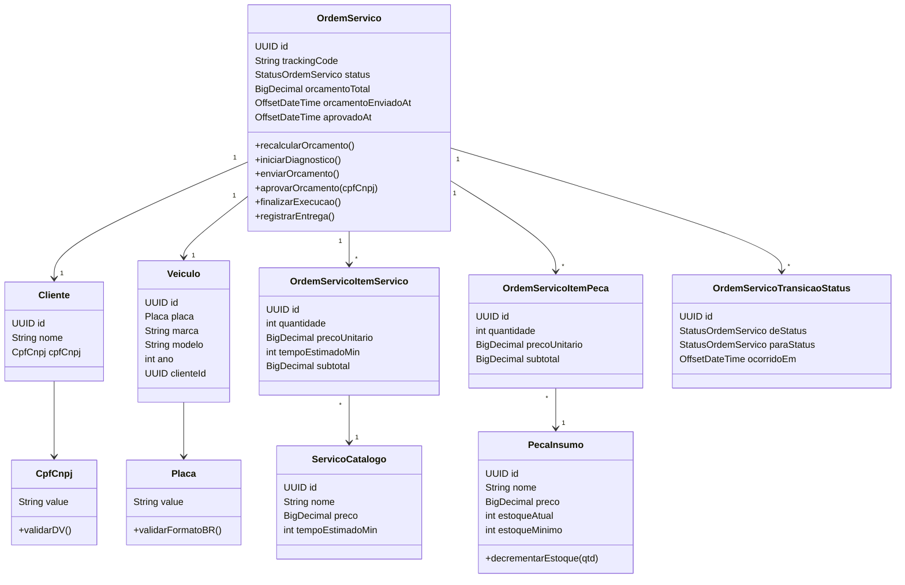
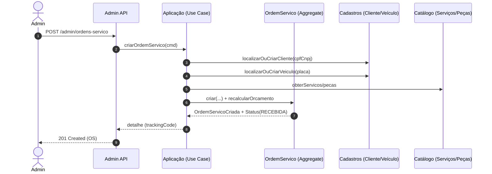
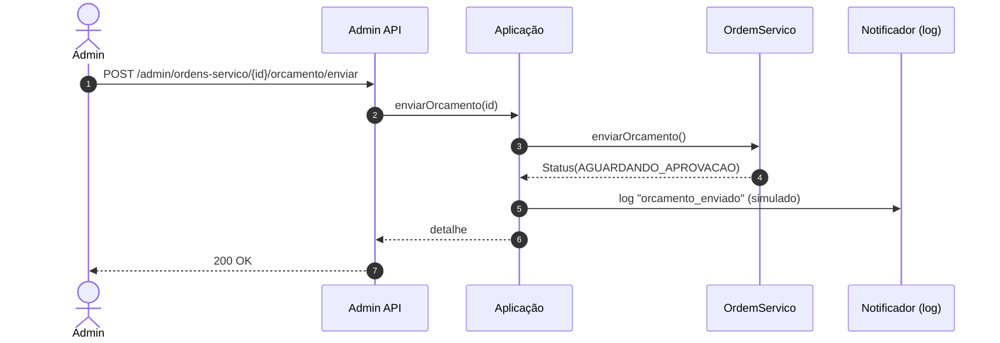
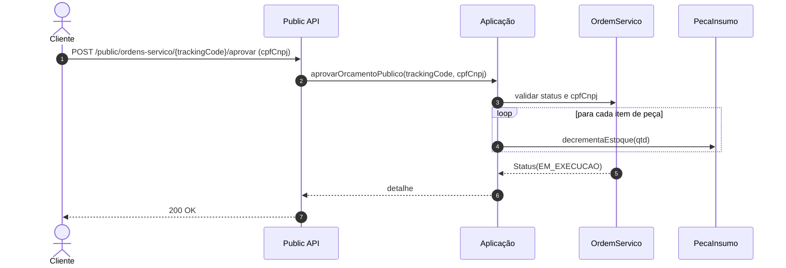
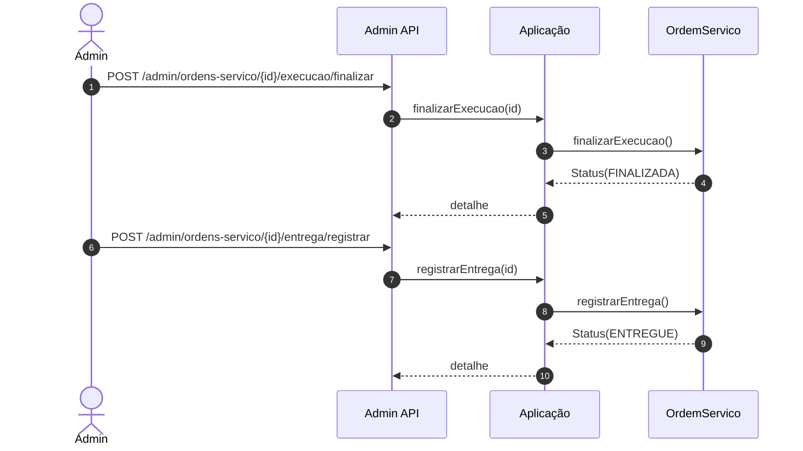

# Diagramas (DDD - Fase 1)

Este documento consolida os diagramas do MVP (Fase 1) do Sistema Integrado de Atendimento e Execução de Serviços de uma oficina.

## Artefatos visuais (SVG - Fase 2)

Versões exportadas para inclusão em PDFs ou apresentações:

- [Agregado Ordem de Serviço](diagrams/ordem-servico-agregado.svg)
- [Event storming - contextos (resumo)](diagrams/event-storming-contextos.svg)
- [Event storming - lousa com elementos C/A/E/P/R e fluxos alternativos](diagrams/event-storming-lousa-elementos.svg)

Conteúdo:
- Context Map (Bounded Contexts em monólito)
- Diagrama de agregados (foco em Ordem de Serviço)
- Sequências principais (Mermaid)

> Observação: os diagramas usam Mermaid para permitir renderização no GitHub/GitLab, e podem ser copiados para o Miro como base.

## 1) Context Map

O MVP é um **monólito em camadas**, porém organizado por **Bounded Contexts** em pacotes.

```mermaid
flowchart LR
  subgraph EXT[Contextos Externos]
    KC[Keycloak\n(Auth Server / JWT)]
    APP[Aplicativo/Portal do Cliente]
  end

  subgraph MONO[Monólito Spring Boot]
    CAD[Cadastros\n(Cliente, Veículo)]
    CAT[Catálogo\n(Serviços, Peças/Insumos)]
    OS[Ordem de Serviço\n(Aggregate Root)]
  end

  APP -->|Consulta/ Aprova Orçamento\n/public| OS
  KC -->|Emite JWT\n(role ADMIN)| MONO

  CAD <--> OS
  CAT <--> OS
```

### Integrações
- O monólito valida JWT emitido pelo Keycloak para rotas administrativas.
- A API pública é consumida pelo app/portal do cliente.

## 2) Diagrama de agregados

### Agregados (pragmático para o MVP)
- **Cliente** (Aggregate Root): identidade por CPF/CNPJ.
- **Veículo** (Aggregate Root): identidade por Placa, associado ao Cliente.
- **Serviço do Catálogo** (Aggregate Root): preço e tempo estimado.
- **Peça/Insumo** (Aggregate Root): preço e controle de estoque.
- **Ordem de Serviço (OS)** (Aggregate Root): itens, orçamento, status e histórico.

> Decisão: a OS referencia Cliente/Veículo/Catálogo via associação (JPA) no MVP, mas o raciocínio de DDD considera invariantes centrais na OS. Em evolução futura, pode-se trocar para referência por ID (anti-corruption boundary) sem afetar a API.



## 3) Sequência - Criação da OS (Admin)



## 4) Sequência - Enviar orçamento (Admin)



## 5) Sequência - Aprovar orçamento (Cliente) com baixa de estoque



## 6) Sequência - Finalizar e entregar (Admin)



## 7) Métrica - Tempo médio de execução

Definição do MVP:
- Tempo de execução de uma OS = `timestamp(FINALIZADA) - timestamp(EM_EXECUCAO)`
- Tempo médio = média para todas as OS (com filtro opcional por período)

A fonte de verdade são as transições de status persistidas na tabela `os_transicoes_status`.
