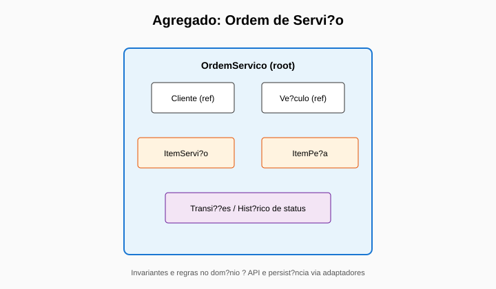
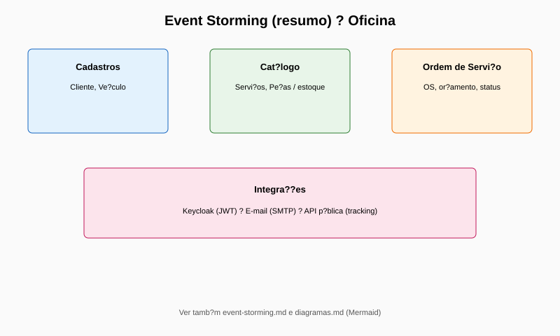

# Tech Challenge — Fases 1 e 2 — Documento de entrega (back-end Oficina)

## Identificação do grupo

- **Nome do grupo:** Oficina Turbo
- **Código/identificador interno:** Grupo 106

## Participantes (nome + Discord)

- **Felipe Ricarte Magalhães** — Discord: **@felipe.ricarte**

## Links do projeto

- **Repositório (privado):** https://github.com/ricartefelipe/oficina-springboot-mvp  
  - **Acesso ao avaliador SOAT:** utilizador de organização **`soat-architecture`** com permissão de leitura (ou conforme o enunciado). Passos: [Convidar o utilizador no GitHub](#1-convidar-soat-architecture-no-repositório).
- **Documento para o PDF do portal (Fase 2):** [`entrega-portal-fase2.md`](entrega-portal-fase2.md) — *estrutura alinhada ao enunciário (repo, arquitetura, vídeo, Swagger).*
- **Swagger (local):** http://localhost:8080/api/swagger-ui/index.html
- **Vídeo demonstrativo (≤ 15 min):** *colar aqui o URL público (YouTube ou Vimeo) após publicação — e o mesmo na tabela de “Links rápidos (APIs e vídeo)” no [README](../../README.md).*
- **PDF deste documento (gerado):** `submission.pdf` (na mesma pasta; ver [Conversão para PDF](#conversão-para-pdf-offline)).

## Diagramas de arquitetura (DDD)





---

## Checklist entrega Fase 2

*O que só podes fazer na tua conta (GitHub, portal da disciplina, gravação do vídeo). Um assistente automatizado não consegue substituir estes passos.*

### 1. Convidar `soat-architecture` no repositório

1. Abre https://github.com/ricartefelipe/oficina-springboot-mvp
2. **Settings** → **Collaborators and teams** (ou **Manage access**)
3. **Add people** / **Invite a collaborator**
4. Pesquisa **`soat-architecture`** (utilizador ou equipa indicada no enunciado) e envia convite com permissão adequada (normalmente **Read** para revisão).
5. Confirma no e-mail/GitHub que o convite foi aceite (se aplicável).

### 2. PDF no portal da disciplina

1. Gera o PDF deste documento (secção [Conversão para PDF](#conversão-para-pdf-offline)).
2. Inclui no PDF (ou anexos) os **diagramas DDD** referidos em [`docs/ddd/diagramas.md`](../ddd/diagramas.md) e os SVG em [`docs/ddd/diagrams/`](../ddd/diagrams/) se o enunciado pedir evidência visual.
3. Faz o upload no **portal SOAT** no prazo indicado pelo professor (o assistente não tem acesso ao portal).

### 3. Vídeo (≤ 15 minutos)

1. Grava o vídeo (deploy, CI/CD, consumo de APIs, escalabilidade — ver [`docs/video-script.md`](../video-script.md)).
2. Publica no **YouTube** (não listado ou público) ou **Vimeo**.
3. Cola o **link público** em:
   - este ficheiro (linha “Vídeo demonstrativo” em [Links do projeto](#links-do-projeto));
   - o [README](../../README.md) na tabela “Links rápidos (APIs e vídeo)”.

### 4. Link do vídeo no README (para não esquecer)

No ficheiro `README.md`, na tabela da secção **Links rápidos (APIs e vídeo)**, substitui a célula do vídeo (texto *Substituir pelo link após publicar…*) pelo URL real do vídeo.

---

## Resumo do entregável

### Fase 1 (MVP)

- CRUDs administrativos: clientes, veículos, serviços, peças/insumos (estoque)
- Ordens de serviço: criação, orçamento automático, transições de estado, listagem e detalhe
- Consulta pública por `trackingCode` e aprovação de orçamento com validações (CPF/CNPJ)
- Segurança: JWT (Keycloak, role ADMIN) nos endpoints admin
- Métrica: tempo médio de execução (EM_EXECUCAO → FINALIZADA)
- Dockerfile + Docker Compose
- Testes (unitários e integração) + JaCoCo
- Documentação DDD (Event Storming, diagramas, linguagem ubíqua) + roteiro de vídeo

### Fase 2 (resiliência e escalabilidade)

- Arquitetura em evolução (hexagonal onde aplicável), testes nos fluxos críticos
- **Kubernetes:** manifestos em `/k8s` (Deployment, Service, HPA, probes, etc.)
- **IaC:** Terraform em `/infra` (rede AWS; **RDS PostgreSQL opcional** via `enable_rds`)
- **CI/CD:** GitHub Actions (Maven, Terraform validate, imagem **GHCR**; workflows manuais para deploy em cluster e Terraform na AWS)
- Diagramas DDD versionados (SVG em `docs/ddd/diagrams/`)

## Relatório de vulnerabilidades (scan)

- **Arquivo do relatório:** `docs/security/vulnerability-report.md`
- **Evidências geradas pelo scan:** `build/security/*`
- **Resumo (valores de exemplo):**
  - CRITICAL: 0
  - HIGH: 0
  - MEDIUM: 2
  - LOW: 6
- **Plano de mitigação:** descrito no relatório (upgrade de dependências, ajustes de configuração e revisão contínua no pipeline).

## Como executar localmente (para o avaliador)

> Pré-requisito: Docker + Docker Compose v2

1. Subir o ambiente:

```bash
docker compose up --build
```

2. Obter token ADMIN (Keycloak):

```bash
export TOKEN="$(./scripts/get-admin-token.sh)"
```

3. Validar endpoints (exemplo):

```bash
curl -i http://localhost:8080/api/admin/clientes \
  -H "Authorization: Bearer ${TOKEN}"
```

4. Rodar testes e cobertura:

```bash
mvn verify
```

5. Rodar scan de vulnerabilidades e gerar evidências:

```bash
./scripts/security/run-security-scans.sh
```

## Conversão para PDF (offline)

**Recomendado (Windows, PDF com diagramas embutidos):** na raiz do repositório:

```powershell
.\scripts\delivery\md-to-pdf-edge.ps1 -InputMd "docs\delivery\submission.md"
```

Gera `docs/delivery/submission.pdf` (e um `.html` intermédio, ignorado pelo Git).

Com [Pandoc](https://pandoc.org/) só (sem diagramas rasterizados como acima):

```bash
pandoc docs/delivery/submission.md -o docs/delivery/submission.pdf
```

**Sem Pandoc no Windows:** `winget install JohnMacFarlane.Pandoc`, ou abrir este `.md` num editor com pré-visualização Markdown e usar **Imprimir → Guardar como PDF**.
