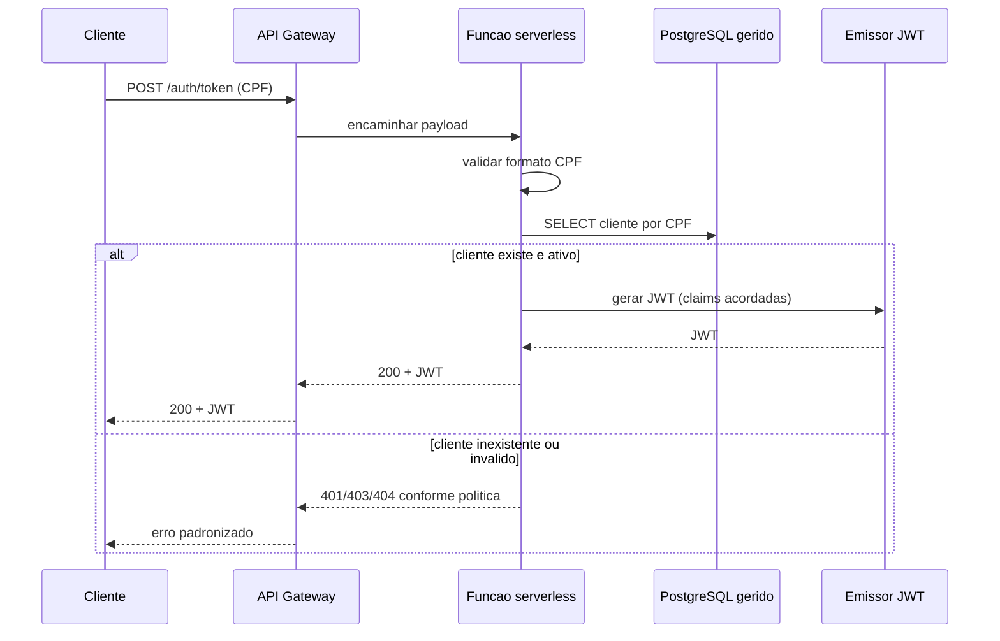
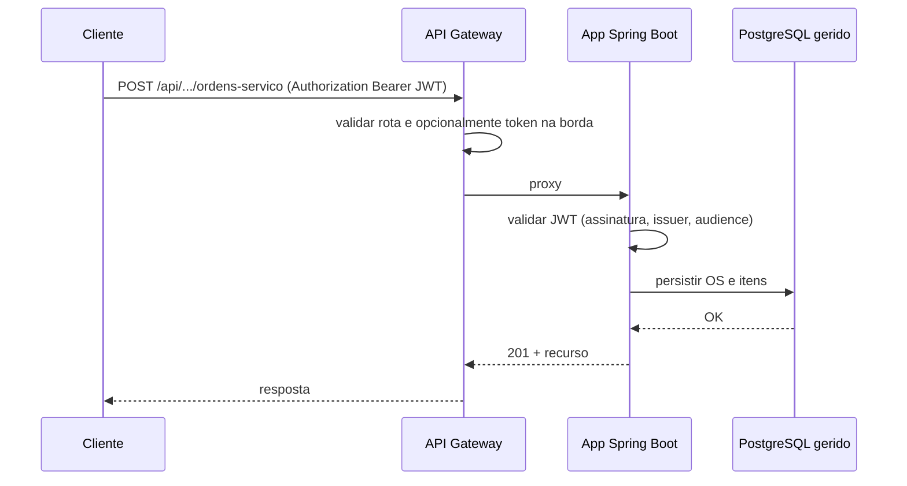

# Diagrama de sequencia - autenticacao (CPF) e abertura de OS

## Autenticacao com CPF (JWT via serverless)

## Abertura de ordem de servico (API protegida)

Estes fluxos serao refinados quando o Gateway e o contrato JWT estiverem definidos nos repositorios de infraestrutura e na aplicacao.
