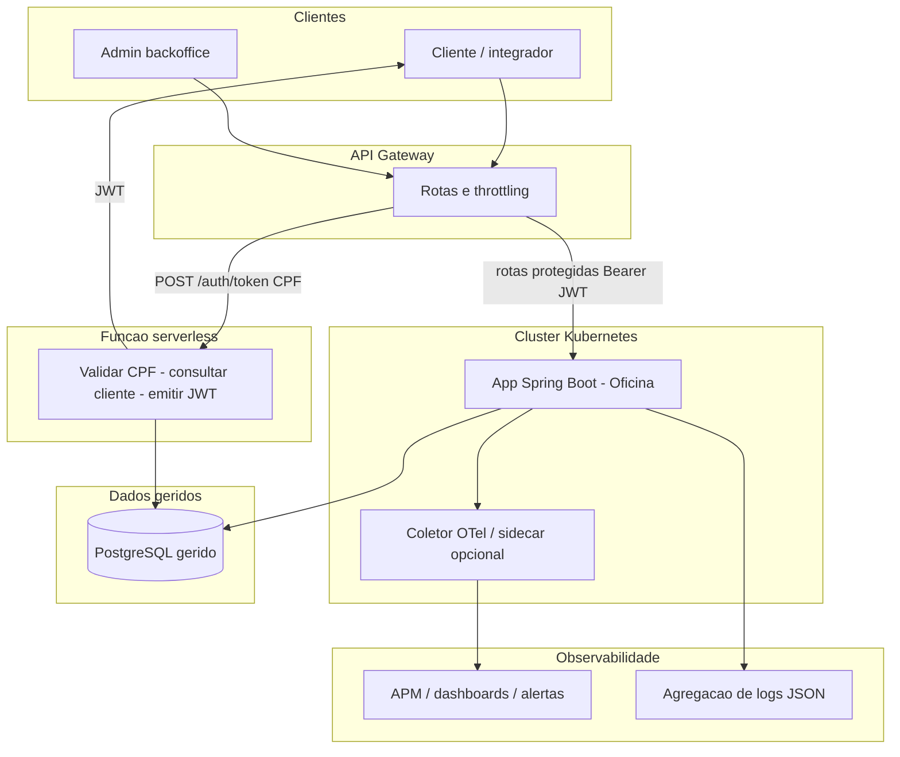

# Visao de arquitetura - Fase 3

## Objetivo

Elevar a solucao da Oficina a operacao **corporativa**: cloud, seguranca em camadas (Gateway + JWT emitido por funcao serverless), segregacao em **quatro repositorios** com CI/CD e deploy automatico, **BD gerido**, **Kubernetes** escalavel e **observabilidade** (metricas, logs estruturados, tracos, dashboards e alertas).

## Diagrama de componentes (visao de nuvem)

Notas:

- O **Keycloak** usado nas fases anteriores para admin pode ser **substituido ou complementado** conforme RFC; o enunciario exige **autenticacao por CPF** via **funcao serverless** e **JWT** para APIs protegidas. A decisao de convivencia ou migracao esta no [RFC-0001](rfc/rfc-0001-autenticacao-cpf-jwt-serverless.md) e nos ADRs.
- **API Gateway** concreto (ex.: AWS API Gateway, Kong, Traefik) e **APM** (ex.: Datadog, New Relic) sao escolhas **a fixar em ADR/RFC**; o diagrama permanece neutro onde possivel.

## Principios

1. **Segregacao de repositorios**: cada repositorio tem pipeline proprio e deploy independente na ordem definida por dependencia de infraestrutura.
2. **Infraestrutura como codigo**: Terraform para cluster e BD gerido; manifests ou modulos para workload no K8s.
3. **Observabilidade by design**: correlacao de requisicoes (`X-Correlation-Id` ou W3C `traceparent`), logs JSON, metricas de negocio e de infra.
4. **Branch protection**: `main` protegida; merges apenas via **Pull Request**; ambientes **homologacao** e **producao** com deploy automatico a partir das branches acordadas.
